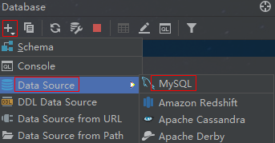
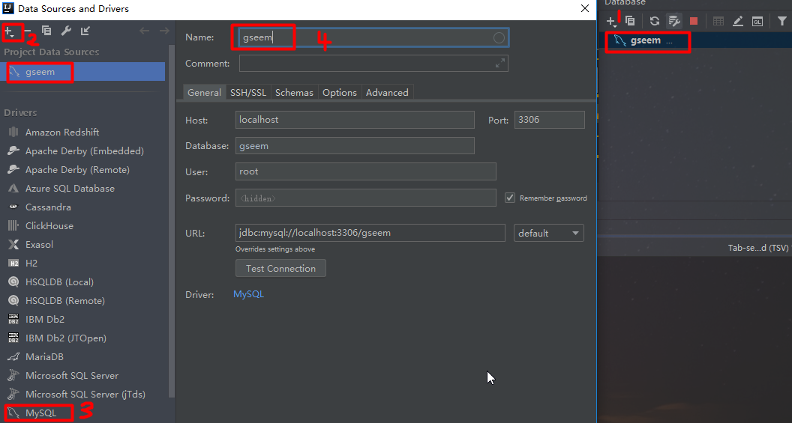

# SpringBoot 使用Jdbc操作数据库

## 数据库
**User用户表**
```
DROP TABLE IF EXISTS `user`;
CREATE TABLE `user` (
  `id` bigint(20) NOT NULL AUTO_INCREMENT COMMENT '主键id',
  `name` varchar(32) DEFAULT NULL COMMENT '用户名',
  `password` varchar(32) DEFAULT NULL COMMENT '密码',
  `age` int(11) DEFAULT NULL COMMENT '年龄',
  PRIMARY KEY (`id`)
) ENGINE=InnoDB DEFAULT CHARSET=utf8;
```

## 依赖包
`mysql-connector-java`:MYSQL驱动包
`spring-boot-starter-jdbc`直接依赖于 HikariCP 和 spring-jdbc;
* HikariCP 是 Spring Boot 2.0 默认使用的数据库连接池，也是传说中最快的数据库连接池。
* spring-jdbc 是 Spring 封装对 JDBC 操作的工具包。
```
<dependency>
    <groupId>org.springframework.boot</groupId>
    <artifactId>spring-boot-starter-jdbc</artifactId>
</dependency>
<dependency>
    <groupId>mysql</groupId>
    <artifactId>mysql-connector-java</artifactId>
    <scope>runtime</scope>
</dependency>
```
## 设置数据源
打开Database面板，添加数据源

设置如下

设置完毕后就可以直接在Idea中执行SQL语句，并且编写的代码中的SQL语句时可以实时提示，方便且不容易出错。

## jdbc单数据源

**application.yml配置文件**

```
spring:
  datasource:
    url: jdbc:mysql://localhost:3306/gseem?serverTimezone=UTC&useUnicode=true&characterEncoding=utf-8&useSSL=true
    username: root
    password: 123456
    driver-class-name: com.mysql.cj.jdbc.Driver
```

**实体类User**
```java
package com.gseem.lesson02.entity;

import lombok.Data;

@Data
public class User {

    /**主键id，自增长*/
    private Long id;
    /**用户名*/
    private String name;
    /**密码*/
    private String password;
    /**年龄*/
    private int age;

    public User() {
    }

    public User(String name, String password, int age) {
        this.name = name;
        this.password = password;
        this.age = age;
    }
}
```

**jdbc数据访问接口类**
```java
package com.gseem.lesson02.repository;

import com.gseem.lesson02.entity.User;

import java.util.List;

/**
 * @author liangpengju
 */
public interface UserRepository {
    /**
     * 新增保存
     * @param user
     * @return
     */
    int save(User user);

    /**
     * 更新修改
     * @param user
     * @return
     */
    int update(User user);

    /**
     * 根据id删除
     * @param id
     * @return
     */
    int delete(long id);

    /**
     * 查找全部
     * @return
     */
    List<User> findALL();

    /**
     * 根据id查询
     * @param id
     * @return
     */
    User findById(long id);

}

```

**jdbc数据访问接口实现类**
```java
package com.gseem.lesson02.repository.impl;

import com.gseem.lesson02.entity.User;
import com.gseem.lesson02.repository.UserRepository;
import com.gseem.lesson02.rowmapper.UserRowMapper;
import org.springframework.beans.factory.annotation.Autowired;
import org.springframework.jdbc.core.BeanPropertyRowMapper;
import org.springframework.jdbc.core.JdbcTemplate;
import org.springframework.stereotype.Repository;

import java.util.List;

/**
 * 类上使用@Repository 注解用于标注数据访问组件
 */
@Repository
public class UserRepositoryImpl implements UserRepository {

    /**
     * SpringJdbc操作工具类
     */
    @Autowired
    private JdbcTemplate jdbcTemplate;

    /**
     * 新增保存
     *
     * @param user
     * @return
     */
    @Override
    public int save(User user) {
        return jdbcTemplate.update("INSERT INTO user(name,password,age) VALUES (?, ?, ?)",
                user.getName(), user.getPassword(), user.getAge());
    }

    /**
     * 更新修改
     *
     * @param user
     * @return
     */
    @Override
    public int update(User user) {
        return jdbcTemplate.update("UPDATE user SET name = ? , password = ? , age = ? WHERE id=?",
                user.getName(),user.getPassword(),user.getAge(),user.getId());
    }

    /**
     * 根据id删除
     *
     * @param id
     * @return
     */
    @Override
    public int delete(long id) {
        return jdbcTemplate.update("DELETE FROM user where id = ? ",id);
    }

    /**
     * 查找全部
     *
     * @return
     */
    @Override
    public List<User> findALL() {
        return jdbcTemplate.query("SELECT * FROM user",new UserRowMapper());
    }

    /**
     * 根据id查询
     *
     * @param id
     * @return
     */
    @Override
    public User findById(long id) {
        return jdbcTemplate.queryForObject("SELECT * FROM user WHERE id = ? ",
                new Object[]{id},new BeanPropertyRowMapper<>(User.class));
    }
}

```

****用户信息查询结果封装类**
UserRowMapper 继承了 RowMapper，RowMapper 可以将数据中的每一行数据封装成用户定义的类，
实现 RowMapper 接口覆盖 mapRow 方法，在 mapRow 方法封装对数据的返回处理。
```java
package com.gseem.lesson02.rowmapper;

import com.gseem.lesson02.entity.User;
import org.springframework.jdbc.core.RowMapper;
import java.sql.ResultSet;
import java.sql.SQLException;

/**
 * 用户查询结果封装类
 */
public class UserRowMapper implements RowMapper<User> {

    /**
     * 封装用户表查询结果
     * @param rs 结果集
     * @param rowNum 记录行
     * @return
     * @throws SQLException
     */
    @Override
    public User mapRow(ResultSet rs, int rowNum) throws SQLException {
        User user = new User();
        user.setId(rs.getLong("id"));
        user.setName(rs.getString("name"));
        user.setPassword(rs.getString("password"));
        user.setAge(rs.getInt("age"));
        return user;
    }
}
```

**测试类**
```java
package com.gseem.lesson02.repository.impl;

import com.gseem.lesson02.entity.User;
import com.gseem.lesson02.repository.UserRepository;
import org.junit.Test;
import org.junit.runner.RunWith;
import org.springframework.beans.factory.annotation.Autowired;
import org.springframework.boot.test.context.SpringBootTest;
import org.springframework.test.context.junit4.SpringRunner;
import java.util.List;

@RunWith(SpringRunner.class)
@SpringBootTest
public class UserRepositoryImplTest {

    @Autowired
    private UserRepository userRepository;

    @Test
    public void testSave() {
        User user =new User("feiyue","123456",20);
        userRepository.save(user);
    }

    @Test
    public void testUpdate() {
        User user =new User("feiyue","123456",18);
        user.setId(1L);
        userRepository.update(user);
    }

    @Test
    public void testDetele() {
        userRepository.delete(1L);
    }

    @Test
    public void testQueryOne()  {
        User user=userRepository.findById(1L);
        System.out.println("user == " + user.toString());
    }

    @Test
    public void testQueryAll()  {
        List<User> users = userRepository.findALL();
        for (User user : users){
            System.out.println("user == "+user.toString());
        }
    }
}
```

# jdbc多数据源

+**数据源配置文件**
```
server:
  port: 9001
spring:
  datasource:
    url: jdbc:mysql://localhost:3306/gseem?serverTimezone=UTC&useUnicode=true&characterEncoding=utf-8&useSSL=true
    username: root
    password: 123456
    driver-class-name: com.mysql.cj.jdbc.Driver
    #主数据源1
    primary:
      jdbc-url: jdbc:mysql://localhost:3306/demo1?serverTimezone=UTC&useUnicode=true&characterEncoding=utf-8&useSSL=true
      username: root
      password: 123456
      driver-class-name: com.mysql.cj.jdbc.Driver
    #从数据源2
    secondary:
      jdbc-url: jdbc:mysql://localhost:3306/demo2?serverTimezone=UTC&useUnicode=true&characterEncoding=utf-8&useSSL=true
      username: root
      password: 123456
      driver-class-name: com.mysql.cj.jdbc.Driver
```

**创建数据源Bean的配置类**
```java
package com.gseem.lesson02.config;

import org.springframework.beans.factory.annotation.Qualifier;
import org.springframework.boot.context.properties.ConfigurationProperties;
import org.springframework.boot.jdbc.DataSourceBuilder;
import org.springframework.context.annotation.Bean;
import org.springframework.context.annotation.Configuration;
import org.springframework.context.annotation.Primary;
import org.springframework.jdbc.core.JdbcTemplate;

import javax.sql.DataSource;

@Configuration
public class DataSourceConfig {

    /**
     * # @Primary 指定为默认数据源
     * # @Qualifier 指定按照名称加载bean
     * # @ConfigurationProperties 指定配置文件
     * # @Bean 创建Bean，指定名称
     * @return
     */
    @Primary
    @Qualifier(value = "primaryDataSource")
    @ConfigurationProperties(prefix = "spring.datasource.primary")
    @Bean(name = "primaryDataSource")
    public DataSource primaryDataSource(){
        return DataSourceBuilder.create().build();
    }

    /**
     * 数据源2
     * @return
     */
    @Qualifier(value = "secondaryDataSource")
    @ConfigurationProperties(prefix = "spring.datasource.secondary")
    @Bean(name = "secondaryDataSource")
    public DataSource secondaryDataSource(){
        return DataSourceBuilder.create().build();
    }

    /**
     * 数据源 1 的JdbcTemplate
     * @param dataSource
     * @return
     */
    @Bean(name = "primaryJdbcTemplate")
    public JdbcTemplate primaryJdbcTemplate(@Qualifier("primaryDataSource") DataSource dataSource){
        return new JdbcTemplate(dataSource);
    }

    /**
     * 数据源 2 的JdbcTemplate
     * @param dataSource
     * @return
     */
    @Bean("secondaryJdbcTemplate")
    public JdbcTemplate secondaryJdbcTemplate(@Qualifier("secondaryDataSource") DataSource dataSource){
        return new JdbcTemplate(dataSource);
    }

    @Qualifier(value = "dataSource")
    @ConfigurationProperties(prefix = "spring.datasource")
    @Bean(name = "dataSource")
    public DataSource dataSource(){
        return DataSourceBuilder.create().build();
    }

    @Bean("jdbcTemplate")
    public JdbcTemplate jdbcTemplate(@Qualifier("dataSource") DataSource dataSource){
        return new JdbcTemplate(dataSource);
    }
}
```

**MultiUserRepository接口**
```java
package com.gseem.lesson02.multirepo;

import com.gseem.lesson02.entity.User;
import org.springframework.jdbc.core.JdbcTemplate;

import java.util.List;

/**
 * @author liangpengju
 */
public interface MultiUserRepository {
    /**
     * 新增保存
     * @param user
     * @return
     */
    int save(User user, JdbcTemplate jdbcTemplate);

    /**
     * 更新修改
     * @param user
     * @return
     */
    int update(User user,JdbcTemplate jdbcTemplate);

    /**
     * 根据id删除
     * @param id
     * @return
     */
    int delete(long id,JdbcTemplate jdbcTemplate);

    /**
     * 查找全部
     * @return
     */
    List<User> findALL(JdbcTemplate jdbcTemplate);

    /**
     * 根据id查询
     * @param id
     * @return
     */
    User findById(long id,JdbcTemplate jdbcTemplate);
}
```

**MultiUserRepositoryImpl实现类**
```java
package com.gseem.lesson02.multirepo.impl;

import com.gseem.lesson02.entity.User;
import com.gseem.lesson02.multirepo.MultiUserRepository;
import com.gseem.lesson02.repository.UserRepository;
import com.gseem.lesson02.rowmapper.UserRowMapper;
import org.springframework.beans.factory.annotation.Autowired;
import org.springframework.jdbc.core.BeanPropertyRowMapper;
import org.springframework.jdbc.core.JdbcTemplate;
import org.springframework.stereotype.Repository;

import java.util.List;

/**
 * 类上使用@Repository 注解用于标注数据访问组件
 */
@Repository
public class MultiUserRepositoryImpl implements MultiUserRepository {

    /**
     * SpringJdbc操作工具类
     * 默认按照名称加载 primaryJdbcTemplate
     */
    @Autowired
    private JdbcTemplate primaryJdbcTemplate;

    private void initJdbcTemplate(JdbcTemplate jdbcTemplate){
        if(jdbcTemplate == null){
            jdbcTemplate= primaryJdbcTemplate;
        }
    }

    /**
     * 新增保存
     *
     * @param user
     * @return
     */
    @Override
    public int save(User user,JdbcTemplate jdbcTemplate) {
        initJdbcTemplate(jdbcTemplate);
        return jdbcTemplate.update("INSERT INTO user(name,password,age) VALUES (?, ?, ?)",
                user.getName(), user.getPassword(), user.getAge());
    }

    /**
     * 更新修改
     *
     * @param user
     * @return
     */
    @Override
    public int update(User user,JdbcTemplate jdbcTemplate) {
        initJdbcTemplate(jdbcTemplate);
        return jdbcTemplate.update("UPDATE user SET name = ? , password = ? , age = ? WHERE id=?",
                user.getName(),user.getPassword(),user.getAge(),user.getId());
    }

    /**
     * 根据id删除
     *
     * @param id
     * @return
     */
    @Override
    public int delete(long id,JdbcTemplate jdbcTemplate) {
        initJdbcTemplate(jdbcTemplate);
        return jdbcTemplate.update("DELETE FROM user where id = ? ",id);
    }

    /**
     * 查找全部
     *
     * @return
     */
    @Override
    public List<User> findALL(JdbcTemplate jdbcTemplate) {
        initJdbcTemplate(jdbcTemplate);
        return jdbcTemplate.query("SELECT * FROM user",new UserRowMapper());
    }

    /**
     * 根据id查询
     *
     * @param id
     * @return
     */
    @Override
    public User findById(long id,JdbcTemplate jdbcTemplate) {
        initJdbcTemplate(jdbcTemplate);
        return jdbcTemplate.queryForObject("SELECT * FROM user WHERE id = ? ",
                new Object[]{id},new BeanPropertyRowMapper<>(User.class));
    }
}

```

**测试类MultiUserRepositoryImplTest**
```java
package com.gseem.lesson02.multirepo.impl;

import com.gseem.lesson02.entity.User;
import com.gseem.lesson02.multirepo.MultiUserRepository;
import org.junit.Test;
import org.junit.runner.RunWith;
import org.springframework.beans.factory.annotation.Autowired;
import org.springframework.boot.test.context.SpringBootTest;
import org.springframework.jdbc.core.JdbcTemplate;
import org.springframework.test.context.junit4.SpringRunner;

@RunWith(SpringRunner.class)
@SpringBootTest
public class MultiUserRepositoryImplTest {

    @Autowired
    private MultiUserRepository multiUserRepository;
    /**数据源1*/
    @Autowired
    private JdbcTemplate primaryJdbcTemplate;
    /**数据源2*/
    @Autowired
    private JdbcTemplate secondaryJdbcTemplate;

    @Test
    public void testSave(){
        User user1 = new User("feiyue","123",20);
        User user2 = new User("cloud","123456",26);
        multiUserRepository.save(user1,primaryJdbcTemplate);
        multiUserRepository.save(user2,secondaryJdbcTemplate);
    }

}

```