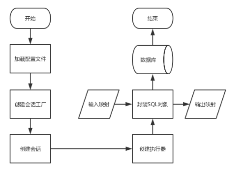

# SpringBoot集成MyBatis XML配置版

## ORM框架
对象关系映射（Object Relational Mapping，ORM）模式是一种为了解决面向对象与关系数据库存在的互不匹配的现象的技术。简单的说，ORM 是通过使用描述对象和数据库之间映射的元数据，
将程序中的对象自动持久化到关系数据库中。
ORM 框架的本质是简化编程中操作数据库的编码，在 Java 领域有2个ORM框架最为流行，，
一个是宣称可以不用写一句 SQL 的 Hibernate，一个是以动态 SQL 见长的 MyBatis，两者各有特点。

## MyBatis 介绍
MyBatis 是一款标准的 ORM 框架，被广泛的应用于各企业开发中。
MyBatis 支持普通的 SQL 查询，存储过程和高级映射的优秀持久层框架。
MyBatis 消除了几乎所有的 JDBC 代码和参数的手工设置以及对结果集的检索封装。
MaBatis 可以使用简单的 XML 或注解用于配置和原始映射，
将接口和 Java 的 POJO（Plain Old Java Objects，普通的 Java 对象）映射成数据库中的记录。

**优点**
* SQL 被统一提取出来，便于统一管理和优化
* SQL 和代码解耦，将业务逻辑和数据访问逻辑分离，使系统的设计更清晰、更易维护、更易单元测试
* 提供映射标签，支持对象与数据库的 ORM 字段关系映射
* 提供对象关系映射标签，支持对象关系组件维护
* 灵活书写动态 SQL，支持各种条件来动态生成不同的 SQL

**缺点**
* 编写 SQL 语句时工作量很大，尤其是字段多、关联表多时，更是如此
* SQL 语句依赖于数据库，导致数据库移植性差

# MyBatis 重要概念
`Mapper 配置`:可以使用基于 XML 的 Mapper 配置文件来实现，也可以使用基于 Java 注解的 MyBatis 注解来实现，
甚至可以直接使用 MyBatis 提供的 API 来实现。

`Mapper 接口`:是指自行定义的一个数据操作接口，类似于通常所说的 DAO 接口。早期的 Mapper 接口需要自定义去实现，
现在 MyBatis 会自动为 Mapper 接口创建动态代理对象。
Mapper 接口的方法通常与 Mapper 配置文件中的 select、insert、update、delete 等 XML 结点存在一一对应关系。

`Executor`:MyBatis 中所有的 Mapper 语句的执行都是通过 Executor 进行的，Executor 是 MyBatis 的一个核心接口。

`SqlSession`:是 MyBatis 的关键对象，是执行持久化操作的独享，类似于 JDBC 中的 Connection，
SqlSession 对象完全包含以数据库为背景的所有执行 SQL 操作的方法，它的底层封装了 JDBC 连接，
可以用 SqlSession 实例来直接执行被映射的 SQL 语句。

`SqlSessionFactory`:是 MyBatis 的关键对象，它是单个数据库映射关系经过编译后的内存镜像。
SqlSessionFactory 对象的实例可以通过 SqlSessionFactoryBuilder 对象类获得，
而 SqlSessionFactoryBuilder 则可以从 XML 配置文件或一个预先定制的 Configuration 的实例构建出。

**MyBatis执行流程**

* 首先加载 Mapper 配置的 SQL 映射文件，或者是注解的相关 SQL 内容。
* 创建会话工厂，MyBatis 通过读取配置文件的信息来构造出会话工厂（SqlSessionFactory）。
* 创建会话。根据会话工厂，MyBatis 就可以通过它来创建会话对象（SqlSession），会话对象是一个接口，
该接口中包含了对数据库操作的增、删、改、查方法。
* 创建执行器。因为会话对象本身不能直接操作数据库，所以它使用了一个叫做数据库执行器（Executor）
的接口来帮它执行操作。
* 封装 SQL 对象。在这一步，执行器将待处理的 SQL 信息封装到一个对象中（MappedStatement），
该对象包括 SQL 语句、输入参数映射信息（Java 简单类型、HashMap 或 POJO）和
输出结果映射信息（Java 简单类型、HashMap 或 POJO）。
* 操作数据库。拥有了执行器和 SQL 信息封装对象就使用它们访问数据库了，最后再返回操作结果，结束流程。

## 依赖包
```
<dependency>
    <groupId>org.mybatis.spring.boot</groupId>
    <artifactId>mybatis-spring-boot-starter</artifactId>
    <version>1.3.2</version>
</dependency>
```

## 数据库
```
CREATE TABLE `user` (
  `id` bigint(20) NOT NULL COMMENT '主键',
  `name` varchar(50) DEFAULT NULL COMMENT '用户名',
  `age` int(11) DEFAULT NULL COMMENT '年龄',
  `sex` tinyint(4) DEFAULT NULL COMMENT '性别0:未知 1:男 2:女',
  `birthday` date DEFAULT NULL COMMENT '生日',
  `createTime` datetime DEFAULT NULL COMMENT '创建时间',
  `updateTime` datetime DEFAULT NULL COMMENT '更新时间',
  `status` int(11) DEFAULT NULL COMMENT '状态',
  PRIMARY KEY (`id`)
) ENGINE=InnoDB DEFAULT CHARSET=utf8mb4;
```

## 配置文件application.yml

```yaml
server:
  port: 8083

#数据源
spring:
  datasource:
    url: jdbc:mysql://localhost:3306/gseem?serverTimezone=UTC&useUnicode=true&characterEncoding=utf-8&useSSL=true
    username: root
    password: 123456
    driver-class: com.mysql.cj.jdbc.Driver

#mybatis  配置文件、mapper-xml文件
mybatis:
  config-location: classpath:mybatis/mybatis-config.xml
  mapper-locations: classpath:mybatis/mapper/*.xml
  type-aliases-package: com.gseem.lesson03.entity
```

# mybatis-generator代码生成器
pom.xml中配置插件`mybatis-generator-maven-plugin`,然后在resources目录下编写generatorConfig.xml配置文件
```xml
<!--mybatis.generator-->
<plugin>
    <groupId>org.mybatis.generator</groupId>
    <artifactId>mybatis-generator-maven-plugin</artifactId>
    <version>1.3.2</version>
    <configuration>
        <configurationFile>src/main/resources/mybatis-generator/generatorConfig.xml</configurationFile>
        <verbose>true</verbose>
        <overwrite>true</overwrite>
    </configuration>
    <executions>
        <execution>
            <id>Generate MyBatis Artifacts</id>
            <goals>
                <goal>generate</goal>
            </goals>
        </execution>
    </executions>
    <dependencies>
        <dependency>
            <groupId>mysql</groupId>
            <artifactId>mysql-connector-java</artifactId>
            <version>5.1.47</version>
        </dependency>
        <dependency>
            <groupId>org.mybatis.generator</groupId>
            <artifactId>mybatis-generator-core</artifactId>
            <version>1.3.5</version>
        </dependency>
        <dependency>
            <groupId>org.mybatis</groupId>
            <artifactId>mybatis</artifactId>
            <version>3.4.5</version>
        </dependency>
    </dependencies>
</plugin>
```


