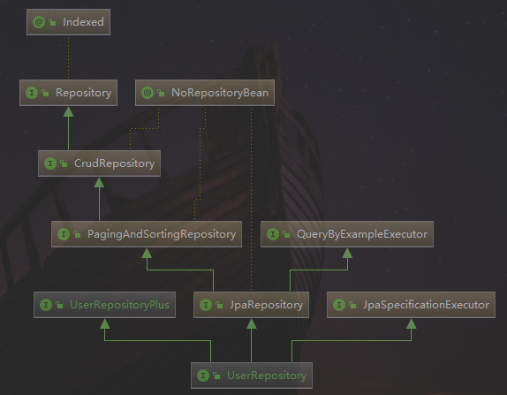

# SpringBoot集成Spring Data JPA进行数据库持久化

### JPA概念
ORM 框架能够将 Java 对象映射到关系数据库中，能够直接持久化复杂的 Java 对象。
目前比较流行的 ORM 框架有 Hibernate、MyBatis、Spring JDBC 等。
JPA（Java Persistence API）是 Sun 官方提出的 Java 持久化规范。
它为 Java 开发人员提供了一种对象 / 关联映射工具来管理 Java 应用中的关系数据。
它的出现主要是为了简化现有的持久化开发工作和整合 ORM 技术，
结束现在 Hibernate、TopLink、JDO 等 ORM 框架各自为营的局面。

Spring Data JPA 是 Spring 基于 ORM 框架、JPA 规范的基础上封装的一套 JPA 应用框架，
可以让开发者用极简的代码即可实现对数据的访问和操作。
它提供了包括增、删、改、查等在内的常用功能，且易于扩展，
学习并使用 Spring Data JPA 可以极大提高开发效率。
Spring Data JPA 其实就是 Spring 基于 Hibernate 之上构建的 JPA 使用解决方案，
方便在 Spring Boot 项目中使用 JPA 技术。

## JPA依赖
```xml
<dependency>
    <groupId>org.springframework.boot</groupId>
    <artifactId>spring-boot-starter-data-jpa</artifactId>
</dependency>
<dependency>
    <groupId>mysql</groupId>
    <artifactId>mysql-connector-java</artifactId>
    <scope>runtime</scope>
</dependency>
```

## application.properties配置文件

```
#jpa mysql
# serverTimezone=UTC 是全球标准时间，比北京时间晚8小时
# 北京时间  GMT%2b8  或 Asia/Shanghai
spring.datasource.url=jdbc:mysql://localhost:3306/gseem?serverTimezone=GMT%2b8&useUnicode=true&characterEncoding=utf-8&useSSL=true
spring.datasource.username=root
spring.datasource.password=123456
spring.datasource.driver-class-name=com.mysql.cj.jdbc.Driver
# create update
spring.jpa.properties.hibernate.hbm2ddl.auto=update
spring.jpa.properties.hibernate.dialect=org.hibernate.dialect.MySQL5InnoDBDialect
#SQL 输出
spring.jpa.show-sql=true
#format 一下 SQL 进行输出
spring.jpa.properties.hibernate.format_sql=true

#添加该配置返回时间是北京时间，否则早8小时
spring.jackson.time-zone=GMT+8
```
`spring.jpa.properties.hibernate.hbm2ddl.auto`配置参数有四个值，分别是：
* create：每次加载 Hibernate 时都会删除上一次生成的表，然后根据 model 类再重新来生成新表，哪怕两次没有任何改变也要这样执行，这就是导致数据库表数据丢失的一个重要原因。
* create-drop：每次加载 Hibernate 时根据 model 类生成表，但是 sessionFactory 一关闭，表就自动删除。
* update：最常用的属性，第一次加载 Hibernate 时根据 model 类会自动建立起表的结构（前提是先建立好数据库），以后加载 Hibernate 时根据 model 类自动更新表结构，即使表结构改变了，但表中的行仍然存在，不会删除以前的行。要注意的是当部署到服务器后，表结构是不会被马上建立起来的，是要等应用第一次运行起来后才会。
* validate ：每次加载 Hibernate 时，验证创建数据库表结构，只会和数据库中的表进行比较，不会创建新表，但是会插入新值。

## 实体类注解
* @Entity(name="User") 必须，用来标注一个数据库表对应的实体类，数据库中创建的表名默认和类名一致（如果没有配置@Table的话）。
其中，name 为可选，对应数据库中一个表，使用此注解标记 Pojo 是一个 JPA 实体。
* @Table(name="user"，catalog=""，schema="") 可选，用来标注一个实体对应的数据库表名，通常和 @Entity 配合使用，
只能标注在实体的 class 定义处，表示实体对应的数据库表的信息。
*  @Id 必须，@Id 定义了映射到数据库表的主键的属性，一个实体只能有一个属性被映射为主键。
*  @GeneratedValue(strategy=GenerationType，generator="") 可选，strategy: 表示主键生成策略，
有 AUTO、INDENTITY、SEQUENCE 和 TABLE 4 种，分别表示让 ORM 框架自动选择，generator: 表示主键生成器的名称。
*  @Column(name = "user_code"， nullable = false， length=32) 可选，
@Column 描述了数据库表中该字段的详细定义，这对于根据 JPA 注解生成数据库表结构的工具。
name: 表示数据库表中该字段的名称，默认情形属性名称一致；
nullable: 表示该字段是否允许为 null，默认为 true；
unique: 表示该字段是否是唯一标识，默认为 false；
length: 表示该字段的大小，仅对 String 类型的字段有效。
*  @Transient可选，@Transient 表示该属性并非一个到数据库表的字段的映射，ORM 框架将忽略该属性

## Repository数据库操作接口
创建的 Repository 只要继承 JpaRepository 即可，就会帮我们自动生成很多内置方法。
另外还有一个功能非常实用，可以根据方法名自动生产 SQL，比如 findByName 会自动生成一个以 name 为参数的查询方法
我们只需要在对应的 Repository 中创建好方法，使用的时候直接将接口注入到类中调用即可。

以UserRepository为例，说明一下使用方法，类层次关系图如下


JpaRepository 继承 PagingAndSortingRepository 和 QueryByExampleExecutor，
PagingAndSortingRepository 类主要负责排序和分页内容，
QueryByExampleExecutor 提供了很多示例的查询方法
因此继承 JpaRepository 的会自动拥有上述这些方法和排序、分页功能。
PagingAndSortingRepository 又继承了 CrudRepository，CrudRepository 内置了最常用的增、删、改、查的方法，方便使用。

**JpaRepository源码**
```java
package org.springframework.data.jpa.repository;

import java.util.List;

import javax.persistence.EntityManager;

import org.springframework.data.domain.Example;
import org.springframework.data.domain.Sort;
import org.springframework.data.repository.NoRepositoryBean;
import org.springframework.data.repository.PagingAndSortingRepository;
import org.springframework.data.repository.query.QueryByExampleExecutor;

/**
 * JPA specific extension of {@link org.springframework.data.repository.Repository}.
 */
@NoRepositoryBean
public interface JpaRepository<T, ID> extends PagingAndSortingRepository<T, ID>, QueryByExampleExecutor<T> {

	List<T> findAll();

	List<T> findAll(Sort sort);

	List<T> findAllById(Iterable<ID> ids);

	<S extends T> List<S> saveAll(Iterable<S> entities);

	/**
	 * Flushes all pending changes to the database.
	 */
	void flush();

	/**
	 * Saves an entity and flushes changes instantly.
	 *
	 * @param entity
	 * @return the saved entity
	 */
	<S extends T> S saveAndFlush(S entity);

	/**
	 * Deletes the given entities in a batch which means it will create a single {@link Query}. Assume that we will clear
	 * the {@link javax.persistence.EntityManager} after the call.
	 *
	 * @param entities
	 */
	void deleteInBatch(Iterable<T> entities);

	/**
	 * Deletes all entities in a batch call.
	 */
	void deleteAllInBatch();

	T getOne(ID id);

	@Override
	<S extends T> List<S> findAll(Example<S> example);

	@Override
	<S extends T> List<S> findAll(Example<S> example, Sort sort);
}

```

**PagingAndSortingRepository源码**
```java
package org.springframework.data.repository;

import org.springframework.data.domain.Page;
import org.springframework.data.domain.Pageable;
import org.springframework.data.domain.Sort;

/**
 * Extension of {@link CrudRepository} to provide additional methods to retrieve entities using the pagination and
 * sorting abstraction.
 *
 * @author Oliver Gierke
 * @see Sort
 * @see Pageable
 * @see Page
 */
@NoRepositoryBean
public interface PagingAndSortingRepository<T, ID> extends CrudRepository<T, ID> {

	/**
	 * Returns all entities sorted by the given options.
	 *
	 * @param sort
	 * @return all entities sorted by the given options
	 */
	Iterable<T> findAll(Sort sort);

	/**
	 * Returns a {@link Page} of entities meeting the paging restriction provided in the {@code Pageable} object.
	 *
	 * @param pageable
	 * @return a page of entities
	 */
	Page<T> findAll(Pageable pageable);
}
```

**QueryByExampleExecutor源码**
```java
package org.springframework.data.repository.query;

import java.util.Optional;

import org.springframework.data.domain.Example;
import org.springframework.data.domain.Page;
import org.springframework.data.domain.Pageable;
import org.springframework.data.domain.Sort;

/**
 * Interface to allow execution of Query by Example {@link Example} instances.
 */
public interface QueryByExampleExecutor<T> {

	/**
	 * Returns a single entity matching the given {@link Example} or {@literal null} if none was found.
	 *
	 * @param example must not be {@literal null}.
	 * @return a single entity matching the given {@link Example} or {@link Optional#empty()} if none was found.
	 * @throws org.springframework.dao.IncorrectResultSizeDataAccessException if the Example yields more than one result.
	 */
	<S extends T> Optional<S> findOne(Example<S> example);

	/**
	 * Returns all entities matching the given {@link Example}. In case no match could be found an empty {@link Iterable}
	 * is returned.
	 *
	 * @param example must not be {@literal null}.
	 * @return all entities matching the given {@link Example}.
	 */
	<S extends T> Iterable<S> findAll(Example<S> example);

	/**
	 * Returns all entities matching the given {@link Example} applying the given {@link Sort}. In case no match could be
	 * found an empty {@link Iterable} is returned.
	 *
	 * @param example must not be {@literal null}.
	 * @param sort the {@link Sort} specification to sort the results by, must not be {@literal null}.
	 * @return all entities matching the given {@link Example}.
	 * @since 1.10
	 */
	<S extends T> Iterable<S> findAll(Example<S> example, Sort sort);

	/**
	 * Returns a {@link Page} of entities matching the given {@link Example}. In case no match could be found, an empty
	 * {@link Page} is returned.
	 *
	 * @param example must not be {@literal null}.
	 * @param pageable can be {@literal null}.
	 * @return a {@link Page} of entities matching the given {@link Example}.
	 */
	<S extends T> Page<S> findAll(Example<S> example, Pageable pageable);

	/**
	 * Returns the number of instances matching the given {@link Example}.
	 *
	 * @param example the {@link Example} to count instances for. Must not be {@literal null}.
	 * @return the number of instances matching the {@link Example}.
	 */
	<S extends T> long count(Example<S> example);

	/**
	 * Checks whether the data store contains elements that match the given {@link Example}.
	 *
	 * @param example the {@link Example} to use for the existence check. Must not be {@literal null}.
	 * @return {@literal true} if the data store contains elements that match the given {@link Example}.
	 */
	<S extends T> boolean exists(Example<S> example);
}
```

**CrudRepository源码**
```java
package org.springframework.data.repository;

import java.util.Optional;

/**
 * Interface for generic CRUD operations on a repository for a specific type.
 */
@NoRepositoryBean
public interface CrudRepository<T, ID> extends Repository<T, ID> {

	/**
	 * Saves a given entity. Use the returned instance for further operations as the save operation might have changed the
	 * entity instance completely.
	 *
	 * @param entity must not be {@literal null}.
	 * @return the saved entity will never be {@literal null}.
	 */
	<S extends T> S save(S entity);

	/**
	 * Saves all given entities.
	 *
	 * @param entities must not be {@literal null}.
	 * @return the saved entities will never be {@literal null}.
	 * @throws IllegalArgumentException in case the given entity is {@literal null}.
	 */
	<S extends T> Iterable<S> saveAll(Iterable<S> entities);

	/**
	 * Retrieves an entity by its id.
	 *
	 * @param id must not be {@literal null}.
	 * @return the entity with the given id or {@literal Optional#empty()} if none found
	 * @throws IllegalArgumentException if {@code id} is {@literal null}.
	 */
	Optional<T> findById(ID id);

	/**
	 * Returns whether an entity with the given id exists.
	 *
	 * @param id must not be {@literal null}.
	 * @return {@literal true} if an entity with the given id exists, {@literal false} otherwise.
	 * @throws IllegalArgumentException if {@code id} is {@literal null}.
	 */
	boolean existsById(ID id);

	/**
	 * Returns all instances of the type.
	 *
	 * @return all entities
	 */
	Iterable<T> findAll();

	/**
	 * Returns all instances of the type with the given IDs.
	 *
	 * @param ids
	 * @return
	 */
	Iterable<T> findAllById(Iterable<ID> ids);

	/**
	 * Returns the number of entities available.
	 *
	 * @return the number of entities
	 */
	long count();

	/**
	 * Deletes the entity with the given id.
	 *
	 * @param id must not be {@literal null}.
	 * @throws IllegalArgumentException in case the given {@code id} is {@literal null}
	 */
	void deleteById(ID id);

	/**
	 * Deletes a given entity.
	 *
	 * @param entity
	 * @throws IllegalArgumentException in case the given entity is {@literal null}.
	 */
	void delete(T entity);

	/**
	 * Deletes the given entities.
	 *
	 * @param entities
	 * @throws IllegalArgumentException in case the given {@link Iterable} is {@literal null}.
	 */
	void deleteAll(Iterable<? extends T> entities);

	/**
	 * Deletes all entities managed by the repository.
	 */
	void deleteAll();
}
```

## 自定义查询
findXXBy、queryXXBy、countXXBy
Spring Data JPA 可以根据接口方法名来实现数据库操作，主要的语法是 findXXBy、readAXXBy、queryXXBy、countXXBy、getXXBy 后面跟属性名称，
利用这个功能仅需要在定义的 Repository 中添加对应的方法名即可，使用时 Spring Boot 会自动帮我们实现
@Query中可以书写JPQL或者原生的SQL语句，原生SQL语句需要设置`nativeQuery = true`
```java
//根据姓名查找
List<User> findByName(String name);
//根据姓名或年龄查找
List<User> findByNameOrAge(String name,int age);

/**
 * 根据姓名查找记录个数
 * 默认使用model查询
 * @param name
 * @return
 */
@Query("select count(t) from User t where t.name = ?1")
int findCountByName(String name);

/**
 * 根据姓名和性别查找
 * nativeQuery = true : 指定使用原生的sql查询
 * @param name
 * @param sex
 * @return
 */
@Query(value = "select t from user t where t.name = ?1 and t.sex = ?2",nativeQuery = true)
List<User> findByNameAndSex(String name,String sex);

/**
 * 根据id更新用户姓名
 * @param name
 * @param id
 * @return
 */
@Transactional(timeout = 10,rollbackFor = DBException.class)
@Modifying
@Query("update User set name = ?1 where id = ?2")
int updateNameById(String  name, Long id);

/**
 * 根据id删除用户
 * @param id
 */
@Transactional(timeout = 10,rollbackFor = DBException.class)
@Modifying
@Query("delete from User where id = ?1")
void deleteUserById(Long id);

```

**具体的关键字，使用方法和生产成 SQL 如下表所示**

Keyword	| Sample |	JPQL snippet
-- 	|  --	| --
And |		findByLastnameAndFirstname	 |	… where x.lastname = ?1 and x.firstname = ?2
Or |		findByLastnameOrFirstname	 |	… where x.lastname = ?1 or x.firstname = ?2
Is，Equals |			findByFirstnameIs，findByFirstnameEquals	 |		… where x.firstname = ?1
Between	 |		findByStartDateBetween	… |		 where x.startDate between ?1 and ?2
LessThan |			findByAgeLessThan	 |		… where x.age < ?1
LessThanEqual	 |		findByAgeLessThanEqual	 |		… where x.age ⇐ ?1
GreaterThan	 |		findByAgeGreaterThan	 |		… where x.age > ?1
GreaterThanEqual	 |		findByAgeGreaterThanEqual	 |		… where x.age >= ?1
After	 |		findByStartDateAfter	 |		… where x.startDate > ?1
Before |			findByStartDateBefore	 |		… where x.startDate < ?1
IsNull |			findByAgeIsNull	 |		… where x.age is null
IsNotNull，NotNull	 |		findByAge(Is)NotNull	 |		… where x.age not null
Like	 |		findByFirstnameLike	 |		… where x.firstname like ?1
NotLike	 |		findByFirstnameNotLike	 |		… where x.firstname not like ?1
StartingWith	 |		findByFirstnameStartingWith	 |		… where x.firstname like ?1 (parameter bound with appended %)
EndingWith	 |		findByFirstnameEndingWith	 |		… where x.firstname like ?1 (parameter bound with prepended %)
Containing	 |		findByFirstnameContaining	 |		… where x.firstname like ?1 (parameter bound wrapped in %)
OrderBy |			findByAgeOrderByLastnameDesc |			… where x.age = ?1 order by x.lastname desc
Not |			findByLastnameNot |			… where x.lastname <> ?1
In	 |		findByAgeIn(Collection ages) |			… where x.age in ?1
NotIn |			findByAgeNotIn(Collection age)	 |		… where x.age not in ?1
TRUE |			findByActiveTrue() |			… where x.active = true
FALSE |			findByActiveFalse()	 |		… where x.active = false
IgnoreCase |			findByFirstnameIgnoreCase	 |		… where UPPER(x.firstame) = UPPER(?1)

## 自定义扩展查询接口和实现类
可以借助于EntityManager来实现更加灵活的sql操作，支持单表和多表组合查询
可以让UserRepository继承该接口，从而具备该接口提供的功能
```java
package com.gseem.lesson04.repository.plus.impl;

import com.gseem.lesson04.dto.req.UserReq;
import com.gseem.lesson04.dto.resp.UserResp;
import com.gseem.lesson04.repository.plus.UserRepositoryPlus;
import org.springframework.data.domain.*;
import org.springframework.util.StringUtils;

import javax.persistence.EntityManager;
import javax.persistence.PersistenceContext;
import javax.persistence.Query;
import java.math.BigInteger;
import java.util.List;
import java.util.stream.Collectors;

/**
 * @author liangpengju-ds
 */
public class UserRepositoryImpl implements UserRepositoryPlus {

    @PersistenceContext
    private EntityManager em;

    private final String selectSql = "select a.id,a.name,a.age,a.sex,a.birthday,a.create_time,a.update_time,a.`status`," +
            "b.city,b.province,b.street,b.zipcode "+
            " from user a left join user_address b on a.id = b.user_id where 1=1 ";

    private final String countSql = "select count(*) from user a left join user_address b on a.id = b.user_id where 1=1 ";

    /**
     * 根据条件查找用户信息
     *
     * @param req
     * @return
     */
    @Override
    public Page<UserResp> findByCondition(UserReq req) {
        StringBuilder dataSql = new StringBuilder(selectSql);
        StringBuilder countSqlBuilder = new StringBuilder(countSql);
        String where = genWhereSql(req);
        //总记录数目
        long totalSize = new BigInteger(em.createNativeQuery(countSqlBuilder.append(where).toString()).getSingleResult().toString()).longValue();
        //分页
        Query dataQuery = em.createNativeQuery(dataSql.append(where).toString());
        Pageable pageable = new PageRequest(req.getPage() - 1, req.getPageSize());
        //排序
        pageable.getSort().and(new Sort(Sort.Direction.ASC,"id"));
        dataQuery.setFirstResult(pageable.getPageNumber() * pageable.getPageSize());
        dataQuery.setMaxResults(pageable.getPageSize());
        List<Object[]> objectList = dataQuery.getResultList();
        //组合返回结果
        List<UserResp> resList = objectList.stream().map(item -> getUserResp(item)).collect(Collectors.toList());
        return new PageImpl<>(resList, pageable, totalSize);
    }

    /**
     * where查询条件
     * @param req
     * @return
     */
    private String genWhereSql(UserReq req) {
        StringBuilder where = new StringBuilder();
        //name
        if(!StringUtils.isEmpty(req.getName())){
            where.append(" AND a.name = '").append(req.getName()).append("'");
        }
        //age
        if(!StringUtils.isEmpty(req.getMaxAge()) && !StringUtils.isEmpty(req.getMinAge())){
            where.append(" AND a.age BETWEEN ").append(req.getMinAge()).append(" AND ").append(req.getMaxAge());
        }
        //b city
        if(!StringUtils.isEmpty(req.getCity())){
            where.append(" AND b.city = '").append(req.getCity()).append("'");
        }
        //按照控制组排序
        where.append(" ORDER BY a.id ");
        return where.toString();
    }


    /**
     *  a.id,a.name,a.age,a.sex,a.birthday,a.create_time,a.update_time,a.`status`,
     *  b.city,b.province,b.street,b.zipcode
     * @param item
     * @return
     */
    private UserResp getUserResp(Object[] item) {
        UserResp res = new UserResp();
        //limit
        res.setId(Long.parseLong(String.valueOf(item[0])));
        res.setName(String.valueOf(item[1]));
        res.setAge(Integer.parseInt(String.valueOf(item[2])));
        res.setSex(Integer.parseInt(String.valueOf(item[3])));
        res.setBirthday(String.valueOf(item[4]));
        res.setCreateTime(String.valueOf(item[5]));
        res.setUpdateTime(String.valueOf(item[6]));
        res.setStatus(Integer.parseInt(String.valueOf(item[7])));
        res.setCity(String.valueOf(item[8]));
        res.setProvince(String.valueOf(item[9]));
        res.setStreet(String.valueOf(item[10]));
        res.setZipcode(String.valueOf(item[11]));
        return res;
    }

}

```

## 继承JpaSpecificationExecutor<T>接口具备复杂查询能力
我们可以通过 AND 或者 OR 等连接词来不断拼接属性来构建多条件查询，但如果参数大于 6 个时，方法名就会变得非常的长，
并且还不能解决动态多条件查询的场景。
到这里就需要给大家介绍另外一个利器 JpaSpecificationExecutor 了。

JpaSpecificationExecutor 是 JPA 2.0 提供的 Criteria API 的使用封装，
可以用于动态生成 Query 来满足我们业务中的各种复杂场景。
Spring Data JPA 为我们提供了 JpaSpecificationExecutor 接口，
只要简单实现 toPredicate 方法就可以实现复杂的查询。

JpaSpecificationExecutor 的源码很简单，根据 Specification 的查询条件返回 List、Page 或者 count 数据。
在使用 JpaSpecificationExecutor 构建复杂查询场景之前，我们需要了解几个概念：
`Root<T> root`，代表了可以查询和操作的实体对象的根，开一个通过 get("属性名") 来获取对应的值。
`CriteriaQuery query`，代表一个 specific 的顶层查询对象，它包含着查询的各个部分，比如 select 、from、where、group by、order by 等。
`CriteriaBuilder cb`，来构建 CritiaQuery 的构建器对象，其实就相当于条件或者是条件组合，并以 Predicate 的形式返回。

```java
@Override
public PagingRes<User> queryUserBySpecification(UserReq req) {
    //拼接where条件
    Specification<User> specification = getWhereClause(req);
    //排序
    Sort sort = new Sort(Sort.Direction.ASC, "id");
    Pageable pageable = PageRequest.of(0, 100, sort);
    Page<User> limits = userRepository.findAll(specification, pageable);
    PagingRes<User> res = new PagingRes<>();
    if (!StringUtils.isEmpty(limits.getContent())) {
        res.setData(limits.getContent());
    }
    res.setTotal(limits.getTotalElements());
    res.setPageSize(100);
    return res;
}

private Specification<User> getWhereClause(final UserReq req){
    return new Specification<User>(){
        /**
         * Creates a WHERE clause for a query of the referenced entity in form of a {@link Predicate} for the given
         * {@link Root} and {@link CriteriaQuery}.
         *
         * @param root            must not be {@literal null}.
         * @param query           must not be {@literal null}.
         * @param criteriaBuilder must not be {@literal null}.
         * @return a {@link Predicate}, may be {@literal null}.
         */
        @Override
        public Predicate toPredicate(Root<User> root, CriteriaQuery<?> query, CriteriaBuilder criteriaBuilder) {
            List<Predicate> predicates = new ArrayList<>();
            //equal
            if(!StringUtils.isEmpty(req.getName())){
                predicates.add(criteriaBuilder.equal(root.get("name"),req.getName()));
            }
            //between 示例
            if (req.getMinAge() != null && req.getMaxAge() != null) {
                Predicate agePredicate = criteriaBuilder.between(root.get("age"), req.getMinAge(), req.getMaxAge());
                predicates.add(agePredicate);
            }
            //greaterThan 大于等于示例
            if (req.getMinAge() != null){
                predicates.add(criteriaBuilder.greaterThan(root.get("age"),req.getMinAge()));
            }
            Predicate[] pre = new Predicate[predicates.size()];
            return query.where(predicates.toArray(pre)).getRestriction();
        }
    };
}
```

## 总结
Spring Data JPA 使用动态注入的原理，根据方法名动态生成方法的实现，因此根据方法名实现数据查询，
即可满足日常绝大部分使用场景。除了这种查询方式之外，
Spring Data JPA 还支持多种自定义查询来满足更多复杂场景的使用，两种方式相结合可以灵活满足项目对 Orm 层的需求。

通过学习 Spring Data JPA 也可以看出 Spring Boot 的设计思想，80% 的需求通过默认、简单的方式实现，满足大部分使用场景，
对于另外 20% 复杂的场景，提供另外的技术手段来解决。
Spring Data JPA 中根据方法名动态实现 SQL，组件环境自动配置等细节，都是将 Spring Boot 约定优于配置的思想体现的淋淋尽致。